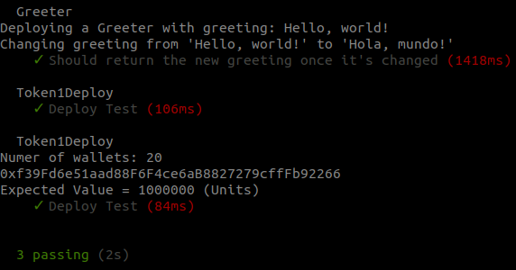

# Overview 

This is a simple example about how to use [Hardhat](https://hardhat.org/) by testing a simple ERC20 Token 


# 1. Requirements 

## 1.1 Hardhat 

Install Hardhat native or Dockerized 

In this example I am using the version I have dockerized, please find the instructions in this [GitHub Repo](https://nicolabernini.github.io/Hardhat-Dockerized/)


## 1.2 OpenZeppelin 

- The `contracts/Token1.sol` needs ERC20 from OpenZeppelin so it is required to clone that repo locally 

Go to `contracts` and run

```
git clone https://github.com/OpenZeppelin/openzeppelin-contracts.git
```


# 2. Create the project 

## 2.1 Scaffolding 

Enter the Hardhat Docker Container or use it native to run from the base project directory 

```
npx hardhat test
```

this will start the Hardhat interactive CLI to create the project scaffolding


## 2.2 Replace the files 

Copy the files in the `to_copy` dir into the related positions, specified by the container dir so 

- `to_copy/contracts/*` --> `contracts/*`

- `to_copy/test/*` --> `test/*`


## 3. Run the tests 

Run the tests with 

```
npx hardhat test
```


The result should be 




# Explanation 

For the explanation check 


